# 10 - Diagrama E/R de Integridad Creada

- Fecha de corte: 2026-02-25
- Fuente: SQL Server `sanjose` (FKs creadas por scripts de gobernanza aplicados en esta sesión).
- Total de FK creadas: 44

## Diagrama (Mermaid)

```mermaid
erDiagram
  AsientoContable ||--o{ Abonos : "FK_Abonos_AsientoContable [Asiento_Id->Id]"
  AsientoContable ||--o{ AsientoContableDetalle : "FK_AsientoContableDetalle_Asiento [AsientoId->Id]"
  AsientoContable ||--o{ DocumentosVenta : "FK_DocumentosVenta_AsientoContable [Asiento_Id->Id]"
  AsientoContable ||--o{ MovInvent : "FK_MovInvent_AsientoContable [Asiento_Id->Id]"
  AsientoContable ||--o{ p_cobrar : "FK_p_cobrar_AsientoContable [Asiento_Id->Id]"
  AsientoContable ||--o{ P_Pagar : "FK_P_Pagar_AsientoContable [Asiento_Id->Id]"
  AsientoContable ||--o{ pagos : "FK_pagos_AsientoContable [Asiento_Id->Id]"
  AsientoContable ||--o{ Pagosc : "FK_pagosc_AsientoContable [Asiento_Id->Id]"
  Asientos ||--o{ Asientos_Detalle : "FK_AsientosDetalle_Asientos [Id_Asiento->Id]"
  Clientes ||--o{ PosVentas : "FK_PosVentas_ClienteId_Clientes [ClienteId->CODIGO]"
  Clientes ||--o{ PosVentasEnEspera : "FK_PosVentasEnEspera_ClienteId_Clientes [ClienteId->CODIGO]"
  DocumentosVenta ||--o{ DocumentosVentaPago : "FK_DocumentosVentaPago_DocumentosVenta [NUM_DOC->NUM_FACT]"
  FiscalCountryConfig ||--o{ FiscalRecords : "FK_FiscalRecords_ConfigContext [EmpresaId+SucursalId+CountryCode->EmpresaId+SucursalId+CountryCode]"
  FiscalRecords ||--o{ FiscalRecords : "FK_FiscalRecords_PreviousHash [PreviousRecordHash->RecordHash]"
  Inventario ||--o{ PosVentasDetalle : "FK_PosVentasDetalle_ProductoId_Inventario [ProductoId->CODIGO]"
  Inventario ||--o{ PosVentasEnEsperaDetalle : "FK_PosEsperaDetalle_Producto [ProductoId->CODIGO]"
  Inventario ||--o{ RestauranteComprasDetalle : "FK_RestauranteComprasDetalle_Inventario [InventarioId->CODIGO]"
  Inventario ||--o{ RestauranteProductos : "FK_RestauranteProductos_ArticuloInventario [ArticuloInventarioId->CODIGO]"
  Inventario ||--o{ RestauranteRecetas : "FK_RestauranteRecetas_Inventario [InventarioId->CODIGO]"
  NominaEmpleado ||--o{ NominaLiquidacion : "FK_NominaLiquidacion_Cedula_Empleado [Cedula->Cedula]"
  NominaEmpleado ||--o{ NominaRun : "FK_NominaRun_Cedula_Empleado [Cedula->Cedula]"
  NominaEmpleado ||--o{ NominaVacacion : "FK_NominaVacacion_Cedula_Empleado [Cedula->Cedula]"
  PosVentasEnEspera ||--o{ PosVentas : "FK_PosVentas_EsperaOrigen [EsperaOrigenId->Id]"
  PosVentasEnEspera ||--o{ PosVentasEnEsperaDetalle : "FK_PosEsperaDetalle_Espera [VentaEsperaId->Id]"
  Proveedores ||--o{ RestauranteCompras : "FK_RestauranteCompras_Proveedor_Proveedores [ProveedorId->CODIGO]"
  RestauranteProductos ||--o{ RestaurantePedidoItems : "FK_RestaurantePedidoItems_ProductoCodigo [ProductoId->Codigo]"
  Usuarios ||--o{ AsientoContable : "FK_AsientoContable_CodUsuario_Usuarios [CodUsuario->Cod_Usuario]; FK_AsientoContable_UsuarioAnulacion_Usuarios [UsuarioAnulacion->Cod_Usuario]; FK_AsientoContable_UsuarioAprobacion_Usuarios [UsuarioAprobacion->Cod_Usuario]"
  Usuarios ||--o{ Compras : "FK_Compras_CodUsuario_Usuarios [COD_USUARIO->Cod_Usuario]"
  Usuarios ||--o{ Cotizacion : "FK_Cotizacion_CodUsuario_Usuarios [COD_USUARIO->Cod_Usuario]"
  Usuarios ||--o{ DocumentosVenta : "FK_DocumentosVenta_CodUsuario_Usuarios [COD_USUARIO->Cod_Usuario]"
  Usuarios ||--o{ Facturas : "FK_Facturas_CodUsuario_Usuarios [COD_USUARIO->Cod_Usuario]"
  Usuarios ||--o{ MovCuentas : "FK_MovCuentas_CoUsuario_Usuarios [Co_Usuario->Cod_Usuario]"
  Usuarios ||--o{ MovInvent : "FK_MovInvent_CoUsuario_Usuarios [Co_Usuario->Cod_Usuario]"
  Usuarios ||--o{ NOTACREDITO : "FK_NOTACREDITO_CodUsuario_Usuarios [COD_USUARIO->Cod_Usuario]"
  Usuarios ||--o{ p_cobrar : "FK_p_cobrar_CodUsuario_Usuarios [COD_USUARIO->Cod_Usuario]"
  Usuarios ||--o{ P_Pagar : "FK_P_Pagar_CodUsuario_Usuarios [Cod_usuario->Cod_Usuario]"
  Usuarios ||--o{ pagos : "FK_pagos_CodUsuario_Usuarios [COD_USUARIO->Cod_Usuario]"
  Usuarios ||--o{ Pagosc : "FK_pagosc_CodUsuario_Usuarios [COD_USUARIO->Cod_Usuario]"
  Usuarios ||--o{ PosVentas : "FK_PosVentas_CodUsuario_Usuarios [CodUsuario->Cod_Usuario]"
  Usuarios ||--o{ PosVentasEnEspera : "FK_PosVentasEnEspera_CodUsuario_Usuarios [CodUsuario->Cod_Usuario]"
  Usuarios ||--o{ RestauranteCompras : "FK_RestauranteCompras_CodUsuario_Usuarios [CodUsuario->Cod_Usuario]"
  Usuarios ||--o{ RestaurantePedidos : "FK_RestaurantePedidos_CodUsuario_Usuarios [CodUsuario->Cod_Usuario]"
```

## Detalle de Relaciones

| FK | Tabla Padre | Tabla Hija | Columnas Hija | Columnas Padre |
|---|---|---|---|---|
| FK_Abonos_AsientoContable | AsientoContable | Abonos | Asiento_Id | Id |
| FK_AsientoContableDetalle_Asiento | AsientoContable | AsientoContableDetalle | AsientoId | Id |
| FK_DocumentosVenta_AsientoContable | AsientoContable | DocumentosVenta | Asiento_Id | Id |
| FK_MovInvent_AsientoContable | AsientoContable | MovInvent | Asiento_Id | Id |
| FK_p_cobrar_AsientoContable | AsientoContable | p_cobrar | Asiento_Id | Id |
| FK_P_Pagar_AsientoContable | AsientoContable | P_Pagar | Asiento_Id | Id |
| FK_pagos_AsientoContable | AsientoContable | pagos | Asiento_Id | Id |
| FK_pagosc_AsientoContable | AsientoContable | Pagosc | Asiento_Id | Id |
| FK_AsientosDetalle_Asientos | Asientos | Asientos_Detalle | Id_Asiento | Id |
| FK_PosVentas_ClienteId_Clientes | Clientes | PosVentas | ClienteId | CODIGO |
| FK_PosVentasEnEspera_ClienteId_Clientes | Clientes | PosVentasEnEspera | ClienteId | CODIGO |
| FK_DocumentosVentaPago_DocumentosVenta | DocumentosVenta | DocumentosVentaPago | NUM_DOC | NUM_FACT |
| FK_FiscalRecords_ConfigContext | FiscalCountryConfig | FiscalRecords | EmpresaId+SucursalId+CountryCode | EmpresaId+SucursalId+CountryCode |
| FK_FiscalRecords_PreviousHash | FiscalRecords | FiscalRecords | PreviousRecordHash | RecordHash |
| FK_PosVentasDetalle_ProductoId_Inventario | Inventario | PosVentasDetalle | ProductoId | CODIGO |
| FK_PosEsperaDetalle_Producto | Inventario | PosVentasEnEsperaDetalle | ProductoId | CODIGO |
| FK_RestauranteComprasDetalle_Inventario | Inventario | RestauranteComprasDetalle | InventarioId | CODIGO |
| FK_RestauranteProductos_ArticuloInventario | Inventario | RestauranteProductos | ArticuloInventarioId | CODIGO |
| FK_RestauranteRecetas_Inventario | Inventario | RestauranteRecetas | InventarioId | CODIGO |
| FK_NominaLiquidacion_Cedula_Empleado | NominaEmpleado | NominaLiquidacion | Cedula | Cedula |
| FK_NominaRun_Cedula_Empleado | NominaEmpleado | NominaRun | Cedula | Cedula |
| FK_NominaVacacion_Cedula_Empleado | NominaEmpleado | NominaVacacion | Cedula | Cedula |
| FK_PosVentas_EsperaOrigen | PosVentasEnEspera | PosVentas | EsperaOrigenId | Id |
| FK_PosEsperaDetalle_Espera | PosVentasEnEspera | PosVentasEnEsperaDetalle | VentaEsperaId | Id |
| FK_RestauranteCompras_Proveedor_Proveedores | Proveedores | RestauranteCompras | ProveedorId | CODIGO |
| FK_RestaurantePedidoItems_ProductoCodigo | RestauranteProductos | RestaurantePedidoItems | ProductoId | Codigo |
| FK_AsientoContable_CodUsuario_Usuarios | Usuarios | AsientoContable | CodUsuario | Cod_Usuario |
| FK_AsientoContable_UsuarioAnulacion_Usuarios | Usuarios | AsientoContable | UsuarioAnulacion | Cod_Usuario |
| FK_AsientoContable_UsuarioAprobacion_Usuarios | Usuarios | AsientoContable | UsuarioAprobacion | Cod_Usuario |
| FK_Compras_CodUsuario_Usuarios | Usuarios | Compras | COD_USUARIO | Cod_Usuario |
| FK_Cotizacion_CodUsuario_Usuarios | Usuarios | Cotizacion | COD_USUARIO | Cod_Usuario |
| FK_DocumentosVenta_CodUsuario_Usuarios | Usuarios | DocumentosVenta | COD_USUARIO | Cod_Usuario |
| FK_Facturas_CodUsuario_Usuarios | Usuarios | Facturas | COD_USUARIO | Cod_Usuario |
| FK_MovCuentas_CoUsuario_Usuarios | Usuarios | MovCuentas | Co_Usuario | Cod_Usuario |
| FK_MovInvent_CoUsuario_Usuarios | Usuarios | MovInvent | Co_Usuario | Cod_Usuario |
| FK_NOTACREDITO_CodUsuario_Usuarios | Usuarios | NOTACREDITO | COD_USUARIO | Cod_Usuario |
| FK_p_cobrar_CodUsuario_Usuarios | Usuarios | p_cobrar | COD_USUARIO | Cod_Usuario |
| FK_P_Pagar_CodUsuario_Usuarios | Usuarios | P_Pagar | Cod_usuario | Cod_Usuario |
| FK_pagos_CodUsuario_Usuarios | Usuarios | pagos | COD_USUARIO | Cod_Usuario |
| FK_pagosc_CodUsuario_Usuarios | Usuarios | Pagosc | COD_USUARIO | Cod_Usuario |
| FK_PosVentas_CodUsuario_Usuarios | Usuarios | PosVentas | CodUsuario | Cod_Usuario |
| FK_PosVentasEnEspera_CodUsuario_Usuarios | Usuarios | PosVentasEnEspera | CodUsuario | Cod_Usuario |
| FK_RestauranteCompras_CodUsuario_Usuarios | Usuarios | RestauranteCompras | CodUsuario | Cod_Usuario |
| FK_RestaurantePedidos_CodUsuario_Usuarios | Usuarios | RestaurantePedidos | CodUsuario | Cod_Usuario |
